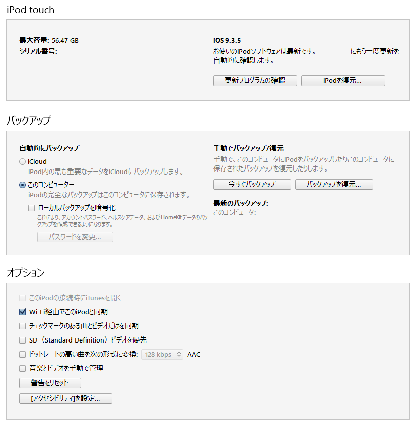
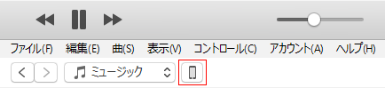
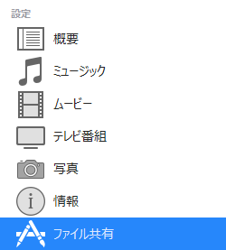
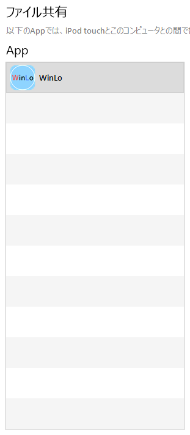

# WinLoからの移行

## はじめに
WinLoで記録していた戦績をWinLo Upperに移行する手順です。

## 準備
移行するためには以下の3つが必要となります。
あらかじめ準備してください。

- WinLo
- WinLo Upper
- iTunesがインストールされたWindowsもしくはMacのPC

PCとの接続が済んだ状態以下の手順を読み移行を進めてください。

## 手順
1. WinLoのデータを出力
    1. 移行したいデータのあるWinLoで設定タブを開く
    2. ファイルに出力を選択
    3. 注意を読んで避ければ「はい」をタップ
    4. WinLoでの出力は以上で終了です。
2. WinLoのデータをPCに移動させる
    1. iTunesを開く
    2. 次のような画面が表示されているか確認  
    
        - 表示されている  
            iiiに進んでください
        - 表示されていない
        iTunesの画面左上にある赤枠で囲ったアイコンをクリックして表示させてください  
            
            - アイコンが表示されていない  
            iTunesが端末をまだ認識していない可能性があります。しばらく待ってください。  
            しばらく経っても表示されなければケーブルの抜き差しなどを試してください。  
            それでも表示されなければ**こちらでは対応できません**。Googleなどで解決法を探してください。
    3. 画面左にあるメニューから「ファイル共有」をクリック  
    
    3. 表示された画面のApp一覧の中から「WinLo」をクリック  
    
    4. App一覧の右側にある「WinLoの書類」にファイルが複数表示される。
    5. どのファイルでも良いのでクリックして`ctrl+A`(Macの場合`cmd+A`)を押しすべて選択する
    6. WinLoの書類欄の右下にある「保存」をクリック
    7. 自分の分かる場所に保存する
        - 新しいフォルダを作成するとこの後の作業が簡単になります。
    8. PCへの移動は以上で終了です。
3. PCのデータをWinLo Upperに移動させる
    1. 同じ端末のWinLo Upperに移動させる場合はそのまま続けます。  
       WinLoと違う端末にあるWinLo Upperに移動させる場合は違う端末をPCに接続の上2-iiiまで進めてください
    2. App一覧からWinLo Upperをクリック
    3. WinLo Upperの書類欄の右下にある「ファイルを追加」をクリック
    4. 先ほど保存したファイルのあるフォルダを開き、**漏れがないように**すべて選択し「開く」をクリック
    5. WinLo Upperの書類欄にファイルが追加されているかを確認する
    6. WinLo Upperへのデータ移動とPCを使った作業は以上で終了です。
4. WinLo Upperでのデータ読み込み
    1. データを移動させたWinLo Upperを起動する
    2. 設定タブへ移動する
    3. 「WinLo形式から読み込み」をタップ
    4, 必要なファイルが正しく移動できていれば読み込みが終了します。
    5. タイトル選択からデータが正しく移行できているか確認してください。
5. 以上でWinLoのデータ移行の勝利はすべて終了です。
